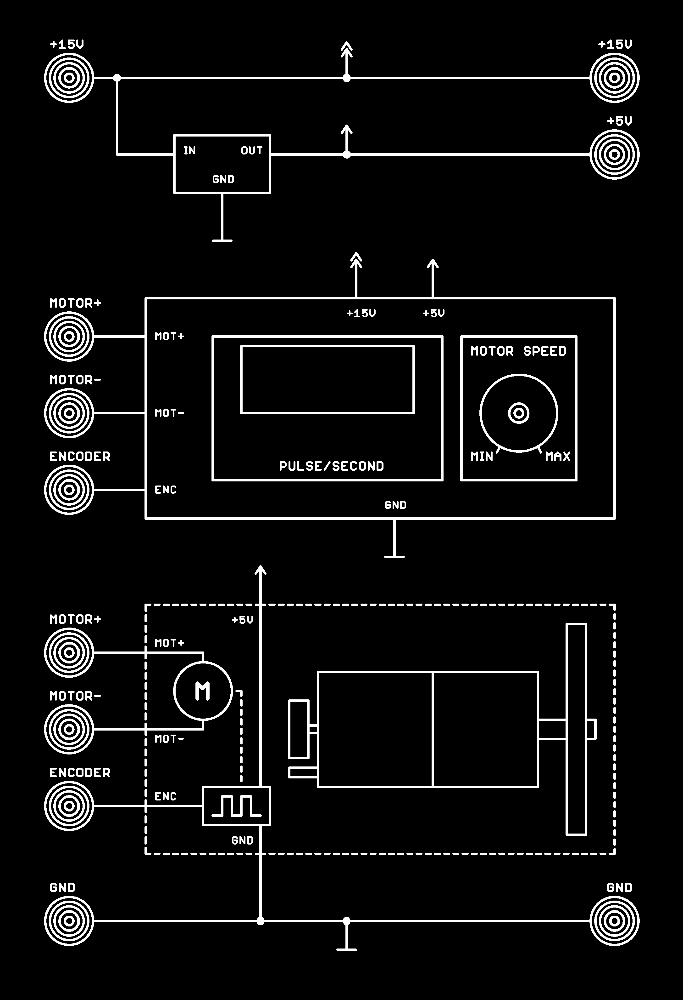

# Dự án module thí nghiệm cảm biến
*Dự án module thí nghiệm cảm biến được thiết kế bởi Vũ Phát*

### Giới thiệu
Dự án bao gồm các module thí nghiệm cảm biến trong trường học, giúp sinh viên dễ dàng tiếp cận, hiểu được cách chuyển đổi tín hiệu trong các loại cảm biến.

### Tính năng
- Interface các module được in trên bền mặt tùy chọn (mica, nhựa, ...) bao bền qua năm tháng
- Đầu jack kết nối chuẩn 4MM phù hợp với dây nối trong trường học
- Kích thước chuẩn A4 tương thích với các giá đỡ

### Danh sách các Module
- Module thí nghiệm cảm biến từ trường (Hall)
- Module thí nghiệm cảm biến hồng ngoại độc lập (1 Phát + 1 thu)
- Module thí nghiệm cảm biến hồng ngoại phản xạ
- Module thí nghiệm cảm biến ánh sáng (LDR)
- Module thí nghiệm cảm biến nhiệt bán dẫn LM335
- Module thí nghiệm cảm biến nhiệt độ RTD PT100
- Module thí nghiệm cảm biến cặp nhiệt TCK
- Module thí nghiệm cảm biến tiệm cận điện dung (Kim loại + phi kim)
- Module thí nghiệm cảm biến tiệm cận kim loại
- Module thí nghiệm đầu ra
- Module thí nghiệm đo tốc độ động cơ encoder
- Module nguồn

### Tài liệu kỹ thuật
[Tài liệu kỹ thuật](documents/Tai_Lieu_Ky_Thuat.pdf)

### Đặt hàng bộ module thí nghiệm
Vui lòng liên hệ tác giả

### Video demo module
[https://www.youtube.com/watch?v=1NZY-7wHZak](https://www.youtube.com/watch?v=1NZY-7wHZak)

[https://www.youtube.com/watch?v=DHiIE1lXe1g](https://www.youtube.com/watch?v=DHiIE1lXe1g)

### Ảnh demo 1 module

